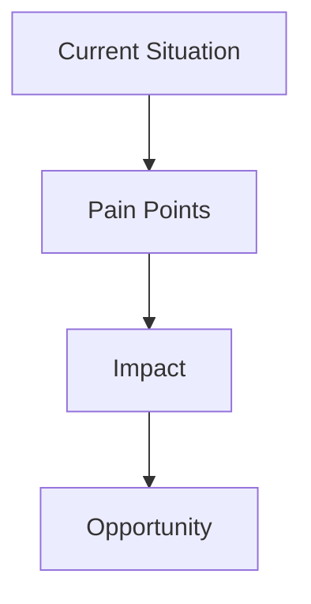
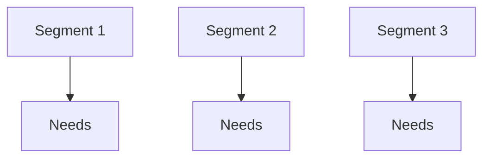

# Product Definition
---
## Product Overview Diagram


---
## Problem Statement
---
### Problem Flow



---
## Solution Description
---
### Solution Architecture (High-Level)


---
## Value Proposition
---
### Value Mapping


---
## Target Customer
---
### Customer Segmentation



---
# Product Definition – Step 1

---

## 1. Core Problem Statement

Mid-to-large IT services firms and consulting organizations invest significant time and senior expertise in analyzing RFP documents and preparing bids.

The process today is:

- Manual  
- Experience-dependent  
- Inconsistent across teams  
- Difficult to standardize  
- Hard to audit or benchmark  

RFPs are unstructured documents that must be translated into:

- Scope definition  
- Work breakdown structure  
- Effort estimation  
- Risk assessment  
- Pricing strategy  

This translation is heavily dependent on senior architects and pre-sales leaders. As a result:

- Estimation quality varies  
- Margins are exposed to hidden scope and risks  
- Bid turnaround time is slow  
- Institutional knowledge remains undocumented  

The core problem is **not reading RFPs faster**.  
It is the absence of a structured, repeatable intelligence layer that converts unstructured RFPs into standardized estimation and risk models.

---

## 2. Primary Customer Persona

### Persona: Head of Pre-Sales / Bid Management

**Company Profile**

- 200–5000+ employees  
- Delivers custom software, system integration, or digital transformation  
- Participates in multiple RFPs monthly  
- Revenue-sensitive to estimation accuracy  

**Responsibilities**

- Coordinate bid response  
- Ensure realistic effort estimates  
- Protect margin  
- Meet submission deadlines  
- Improve bid process consistency  

**Core Motivation**

- Reduce dependency on specific senior architects  
- Standardize estimation methodology  
- Improve predictability and margin control  
- Shorten bid turnaround without sacrificing diligence  

---

## 3. Secondary Stakeholders

| Stakeholder | Primary Concern |
|------------|-----------------|
| Solution Architects | Technical breakdown accuracy |
| Delivery Heads | Execution feasibility & margin realization |
| CFO / Finance | Pricing accuracy & risk exposure |
| Sales Leadership | Competitiveness & win rate |
| PMO / Governance | Standardization & auditability |

Each stakeholder evaluates the product differently — technical reliability, financial control, or governance integrity.

---

## 4. Critical Pain Points

### 4.1 Manual RFP Decomposition
- Long documents (often 100+ pages)
- Hidden assumptions and vague requirements
- Inconsistent requirement extraction

### 4.2 Estimation Variability
- Different architects produce different numbers
- Assumptions remain undocumented
- Limited estimation audit trail

### 4.3 Margin Erosion
- Underestimated complexity
- Overlooked integration risks
- Scope ambiguity leading to overruns

### 4.4 Knowledge Fragmentation
- Estimation logic lives in individuals
- Past bids are stored but not structured for reuse

### 4.5 Time Pressure
- Compressed deadlines
- Trade-off between speed and thoroughness

### 4.6 Informal Risk Evaluation
- Risk mostly qualitative
- No structured scoring model
- No scenario simulation

---

## 5. Existing Alternatives & How They Solve It

### 5.1 Excel-Based Estimation Templates
- Standardized format
- Manual effort inputs
- Rule-of-thumb multipliers
- No intelligent reasoning layer

### 5.2 Internal Knowledge Repositories
- Past proposals stored in document systems
- Manual search and reuse
- No structured indexing

### 5.3 Generic AI Tools
- Summarize RFP content
- Extract high-level requirements
- Do not integrate with structured estimation logic

### 5.4 Bid Management Platforms (e.g., RFPIO, Loopio)
- Focus on response drafting
- Manage answer libraries
- Not designed for effort modeling or pricing intelligence

### 5.5 ERP / PSA Systems
- Used post-sales for delivery tracking
- Not optimized for pre-sales estimation intelligence

---

## 6. Why Current Solutions Are Insufficient

- Spreadsheets standardize format but not reasoning.
- Generic AI summarizes but does not model cost structure.
- Bid tools manage content, not decision support.
- Historical bids are not structured into reusable estimation patterns.
- Risk and pricing simulation are not integrated into a single framework.

### Enterprise Reality Check

Many enterprises believe their internal frameworks are “good enough.”  
Convincing them requires:

- Proven reliability  
- Transparent logic  
- Clear ROI evidence  
- Governance compliance  

---

## 7. Clear Value Proposition (Without Marketing Hype)

The platform aims to:

- Provide a structured framework for converting RFP content into standardized work entities
- Improve estimation consistency across teams
- Surface potential risk indicators early
- Create an auditable estimation trail
- Reduce over-reliance on individual experts

Time reduction claims (e.g., 40–60%) are currently speculative and require validated pilot data.

The core value is:

> **Consistency, visibility, and institutional memory — not automation hype.**

---

## 8. Key Assumptions That Must Be True

1. RFPs contain enough structured signal for reliable extraction.
2. Effort estimation patterns are partially repeatable.
3. Organizations are willing to formalize estimation logic.
4. Historical bid data is available and usable.
5. Enterprises will trust AI-assisted breakdowns.
6. Risk can be partially inferred from textual patterns.
7. Estimation variability is significant enough to justify intervention.

If these assumptions fail, the product risks becoming a productivity tool rather than a strategic platform.

---

## 9. Market Risks

### 9.1 Trust Barrier
- AI influencing pricing decisions is sensitive
- Errors directly affect margin

### 9.2 Data Sensitivity
- RFPs and pricing are confidential
- High compliance scrutiny

### 9.3 Customization Burden
- Each enterprise has unique estimation methodology
- Over-standardization may reduce adoption

### 9.4 Change Management
- Senior architects may resist perceived automation
- Process change required, not just software deployment

### 9.5 Weak Defensibility Risk
- Estimation ontology is replicable
- Large enterprises can build internal tools
- Data advantage only emerges at scale

### 9.6 Long Sales Cycle
- Enterprise procurement is slow
- ROI proof required early

---

## 10. Non-Goals (What This Product Is NOT)

- Not a full proposal drafting automation engine
- Not a replacement for senior architects
- Not a guaranteed win-rate optimization system
- Not an autonomous pricing decision-maker
- Not a generic document summarizer
- Not a project execution or PSA tool

---

# Conceptual Flow (Problem → Structured Intelligence)

```mermaid
flowchart LR
    A[Unstructured RFP Document] --> B[Requirement Extraction]
    B --> C[Structured Work Breakdown]
    C --> D[Effort Estimation Model]
    D --> E[Risk Assessment]
    E --> F[Pricing Scenarios]
    F --> G[Decision Support Output]