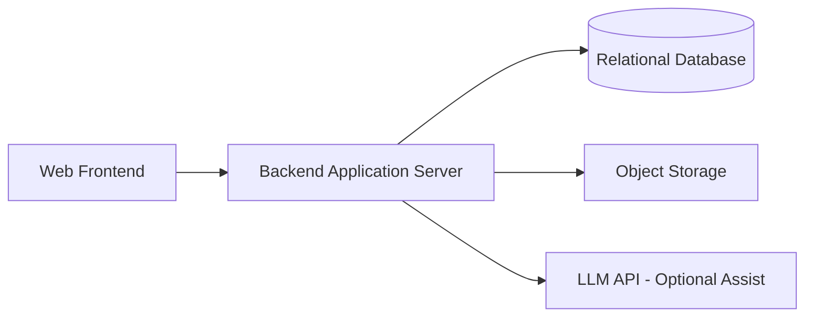
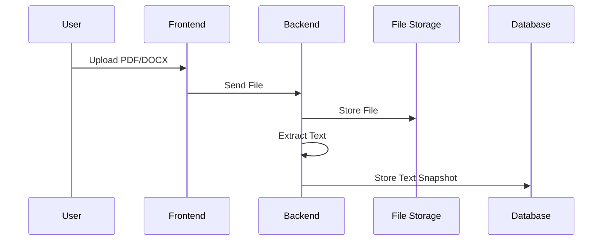
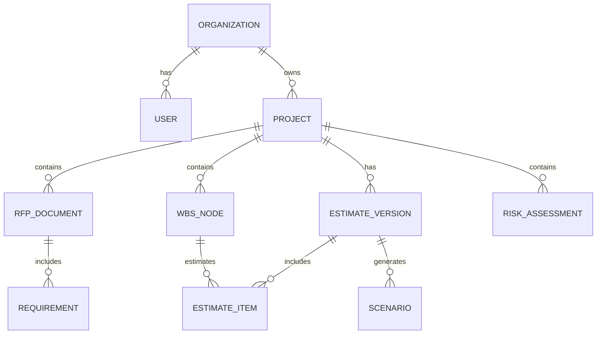
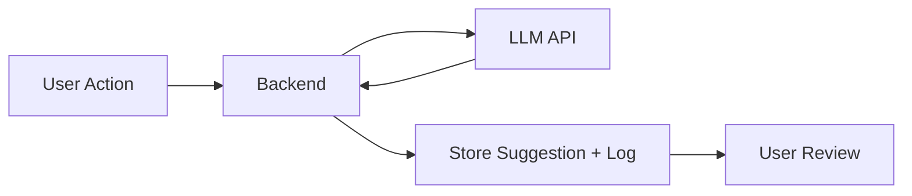

# Step 4 – MVP System Architecture  
**AI RFP Estimation Intelligence Platform**

---

# 1. High-Level Architecture Overview

## Architecture Style: Modular Monolith

### Why Modular Monolith (Not Microservices)?

- 3–4 month MVP timeline
- Small engineering team (2–5 developers assumed)
- Domain still evolving (avoid premature service boundaries)
- Easier deployment, debugging, and audit tracing
- Lower operational overhead

### Logical Architecture View

### Principles

- Single deployable backend
- Clear internal module boundaries
- Service layer abstraction
- Minimal external dependencies
- AI is optional assistive layer, not core logic

---

# 2. Core System Components

## 2.1 Frontend (Web UI)

Purpose:
- RFP upload
- Requirement tagging
- Work breakdown editor
- Estimation configuration
- Risk scoring input
- Scenario comparison
- Audit history view

Responsibilities:
- Authenticated user access
- Form validation
- Real-time estimate recalculation (basic)
- Version comparison UI

---

## 2.2 Backend Application (Single Codebase)

### Internal Modules

#### A. Authentication & Access Module
- User management
- Role-based access control
- Organization isolation

#### B. RFP Document Module
- File upload handling
- Text extraction
- Requirement tagging persistence

#### C. Work Breakdown Module
- Module creation
- Sub-component hierarchy
- Editable taxonomy

#### D. Estimation Engine Module
- Effort calculation
- Complexity multiplier
- Risk buffer %
- Contingency %
- Version snapshots
- Change tracking

#### E. Risk Scoring Engine
- Predefined risk template
- Weighted scoring
- Rule-based buffer suggestion

#### F. Scenario Engine
- Base estimate cloning
- Scenario adjustments
- Comparison view generation

#### G. Audit & Versioning Module
- Estimate revisions
- Risk changes
- Assumption updates
- User actions tracking

---

# 3. Data Flow (Upload to Output)

## Step 1 – RFP Upload

---

## Step 2 – Requirement Tagging

- Extracted text displayed in UI
- User manually tags:
  - Functional
  - Non-functional
  - Integration
  - Assumption
- Tagged entries stored in database

---

## Step 3 – Work Breakdown Creation

- Tagged requirements converted into WBS nodes
- Architect edits structure
- System stores hierarchical tree

---

## Step 4 – Estimation

- Architect enters:
  - Base effort
  - Complexity multiplier
  - Buffer %
- Estimation engine calculates totals
- Version snapshot created

---

## Step 5 – Risk Scoring

- User scores risk categories (1–5)
- System calculates weighted index
- Suggested buffer range generated
- Stored with justification notes

---

## Step 6 – Scenario Comparison

- Clone base estimate
- Adjust buffer / pricing
- Generate comparison view

---

# 4. Database Design

---

## Core Tables

### organization
- id
- name
- region
- created_at

### user
- id
- organization_id
- role (admin / architect / reviewer)
- email
- password_hash

### project
- id
- organization_id
- name
- status

### rfp_document
- id
- project_id
- file_path
- extracted_text
- uploaded_by
- uploaded_at

### requirement
- id
- rfp_document_id
- type
- text
- tagged_by

### wbs_node
- id
- project_id
- parent_id
- title
- description
- order_index

### estimate_version
- id
- project_id
- version_number
- created_by
- created_at

### estimate_item
- id
- estimate_version_id
- wbs_node_id
- base_effort
- complexity_multiplier
- adjusted_effort

### risk_assessment
- id
- project_id
- version_id
- scope_clarity_score
- integration_score
- dependency_score
- timeline_score
- domain_score
- overall_index
- notes

### audit_log
- id
- entity_type
- entity_id
- action
- changed_by
- timestamp
- change_snapshot (JSON)

---

# 5. AI / LLM Usage Strategy

AI is assistive only.

## Use Cases

- Suggest requirement tags
- Suggest potential missing risks
- Summarize large RFP sections
- Generate assumption draft

## Invocation Flow

---

# 6. Risk Scoring Logic

| Category | Weight |
|----------|--------|
| Scope clarity | 25% |
| Integration complexity | 20% |
| Third-party dependency | 15% |
| Timeline pressure | 20% |
| Domain unfamiliarity | 20% |

Formula:

Risk Index = Σ (Score × Weight)

Buffer Suggestion:

- Low (1.0–2.0) → +5%
- Medium (2.1–3.5) → +10%
- High (3.6–5.0) → +15–20%

---

# 7. Deployment Model

## Cloud Pattern

- Managed App Hosting (Container-based)
- Managed Relational Database
- Managed Object Storage
- Single-region deployment
- No Kubernetes required for MVP

---

# 8. Security Considerations

- Organization-level data isolation
- TLS encryption in transit
- Encrypted storage at rest
- Role-based access control
- Immutable audit logs
- Enterprise LLM endpoint (no training on customer data)
- Daily database backups
- File versioning enabled

---

# 9. Scalability Considerations (Future)

- Async job queue for parsing
- Separate estimation engine service
- Dedicated analytics service
- ML prediction service
- Multi-region deployment

---

# 10. Technical Trade-offs

| Decision | Trade-off |
|----------|-----------|
| Modular monolith | Less independent scaling |
| Rule-based risk | No predictive intelligence |
| Manual tagging | Slower than automation |
| Relational DB | Less flexible than document DB |
| Limited AI | Not AI-heavy positioning |

---

# Final Architecture Philosophy

- Structured estimation governance system
- Assisted intelligence (not automation-first)
- Clean modular monolith
- Audit-first design
- Built for clarity, maintainability, and evolution
